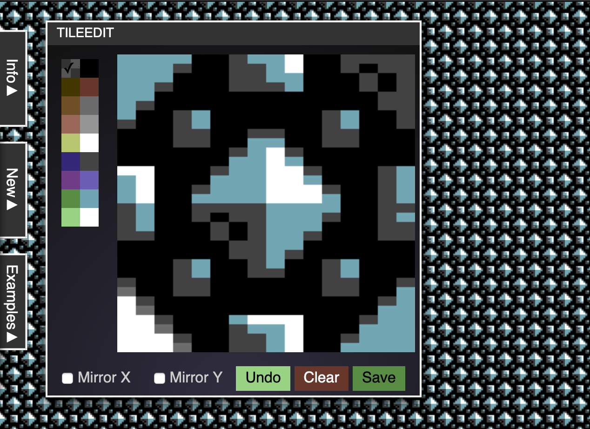
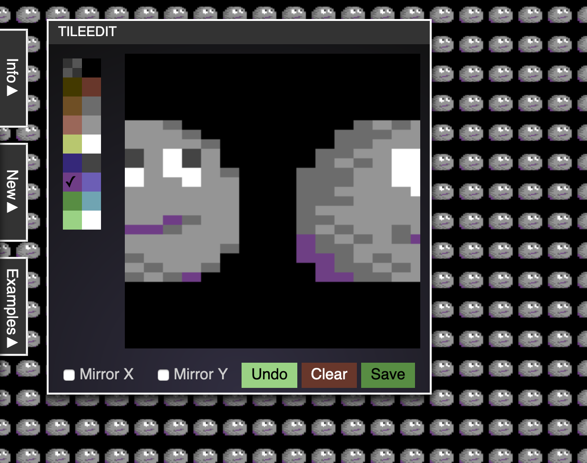

# TileEdit

[TileEdit](https://codepo8.github.io/TileEdit/) is a simple editor to pixel repeating tiles.
The limitations are 16 colours and each pixel is 2x1 pixels, which is the Multicolour mode of the Commodore 64.

Click any of the colours to pick them and paint on the square. To delete a pixel, click the transparent (checkered) colour. The current colour is indicated by a ✓. You can turn on horizontal or vertical mirroring to make it easier to pixel seamless tiles. Press save to store the image as a PNG.
If you want to edit an existing tile, simply drag and drop the image onto the square or paste the image into the browser.

You can start a new tile by clicking the `new` menu. Define the tile size as `10x10` `5x20` or similar. Defining a new tile size deletes the current tile. Press `Set` to do that.

Click `examples` and one of the images to see what your creations could look like.

Written by [Chris Heilmann](https://christianheilmann.com).