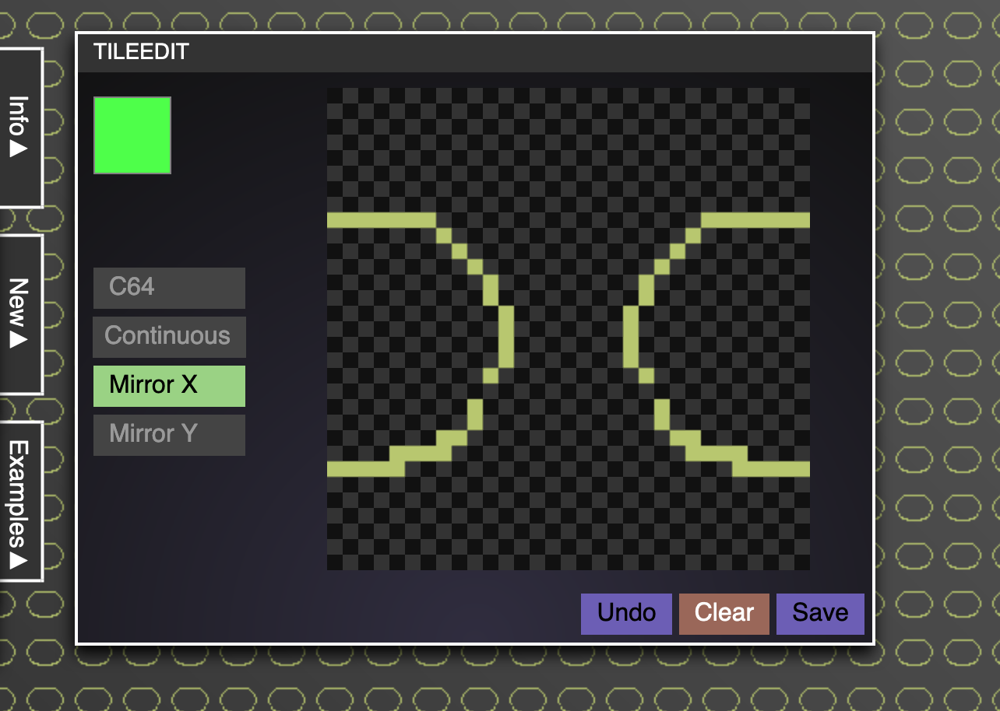
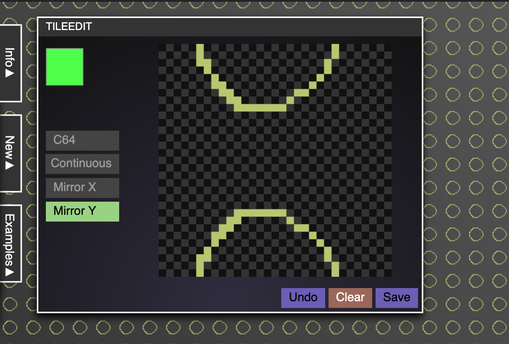
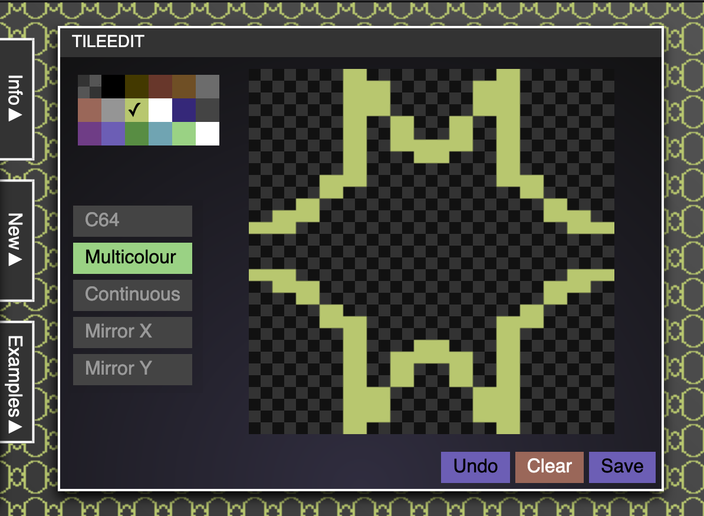

# TileEdit

[TileEdit](https://codepo8.github.io/TileEdit/) is a simple editor to pixel repeating tiles.

You have a live preview of the tiles in the background.

I created it as I had to paint some textures for a demo, and for the fun of it. 

You can edit, `Clear` the whole canvas, `Undo` the last move (sorry, no multiple undo yet) and click `Save` to get your creation as a PNG file.

## Getting started 

You can start by clicking the `new` menu and defining a tile size. The editor shows pixels 10 times bigger than they are, so make sure you have enough space. 

I've also included some tiles I made in the `examples` menu. Click any of them to open them in the editor. 

## Editing existing tiles

You can edit existing files either by dragging and dropping them onto the editor or by pasting them.

## Edit modes 

TileEdit has two different modes, C64 mode and normal mode. 

### C64 Mode

This mode for has the limitations of a Commodore 64. These are:

* 16 pre-defined colours
* Multicolour pixels are 2x1 and not 1x1 

Notice: A real C64 also has the limitation of allowing only 3 colours in Multicolour mode in each 8x8 pixels or 2 colours in Hi-res mode. I didn't add this yet.

Click any of the colours in the palette to pick it and paint on the square. To delete a pixel, click the transparent (checkered) colour. The current colour is indicated by a ✓. 

In Multicolour mode you have pixels that are 2x1 pixels in dimension. 

If you disable Multicolour, you get 1x1 hi-res pixels. 

## Non-C64 Mode

If you don't want to be limited, you can also turn off the C64 Mode and you get a colour picker to choose any colour you like. 

## Continuous mode 

If you enable continuous mode, you can paint by moving the mouse without having to press down the mouse button. You can also enable/disable continuous mode by double-clicking the canvas.

## Mirroring for easier seamless tiles

You can turn on horizontal or vertical mirroring to make it easier to pixel seamless tiles.

If you turn on the `Mirror X` option, all pixels will be mirrored on the vertical axis of the canvas.

If you turn on the `Mirror Y` option, all pixels will be mirrored on the horizontal axis of the canvas.

If you enable both, the pixels will be mirrored on both. 

This works in both modes. 

## Bug reports and contributions

TileEdit is free and open source, and hosted on GitHub. If you find a bug, or you want to add some functionality, feel free to send me a pull request or file an issue here. 

Written by [Chris Heilmann](https://christianheilmann.com).